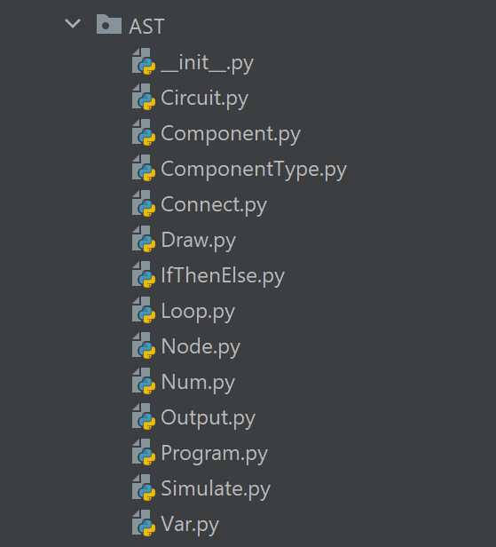

# CPSC 410 Milestone 1

## Usecase

The DSL is meant to be a language to generate circuit diagram. Users can choose from different types of components and compose them to be a valid circuit. We can then simulate the signal flow through the circuit and show the final state of component (like if a bulb can be lighten up or not based on the circuit)

- useful for generating arbitrarily complex logical circuit diagrams
    - can be used for academic reports/assignments for EE students
    - help students to understand the circuit working pattern
- supported features: 
    - students can choose from a set of components (switch, light bulb, AND, OR, )
    - componenets and defined circuits can be reused by refering the name
    - validate component and circuit nesting 
    - simulate the signal flow: for each component's every input and output line, show the signal value (e.g. for an AND gate, we will show both of its input and its output value at the side of port), we can even let user to define a custom input (a function of input value that change based on time)

## Syntax:

We are expecting to have a syntax structure similar to `dot` language

```dot    
circuit c {
    INPUT i1 => AND a1
    INPUT i2 => a1
    a1 => OUTPUT o1
}
```
This should generate a circuit which has 2 inputs, connected to the AND gate, and the AND gate connected to the output. We can also check the signal on everyline to see what's the signal on this line (1/0)

## Task
- Grammar rules (including both lexing and parsing rule)
- Further library research to draw the circuit (need a handy drawing library)
- Code generation (DSL will generate as library codes to achieve both drawing and interactivity), a mapping between DSL structures and library code structures need to be developed
## Further design

- Design an order for placing and drawing the components, since users won't give us those, we have to decide for them
- Scope of name, we haven't decide how the component name is gonna scoped. Since we allow users to reuse based on name, lexical scope will be a straightforward option, but we haven't discussed it.
- We might also design label feature to allow users to add annotations to a component, the syntax and detail of that are not decided yet

## TA feeback (it's already addressed, just for reference)
1. You did remove the coordinate in your example, but you still mentioned specifying coordinate in the features. Might be good to move that as “follow-up features to design”
2. “We can have a variable semantics like general programming language” — not exactly sure what you mean here
3. Honestly, I wouldn’t list enforcing unique circuit name as a feature (but I agree it definitely simplify your language implementation) and it’s not the reason “component can be reused”. I can reuse components even with variable shadowing.
4. “nesting structure” and “component reuse” are essentially the same thing in your context (so no need to mention them twice IMO)
5. “Simulate the signal flow” is too vague. Does that mean users can define their input pattern? (Like a 0-1 function over time, this itself is also a good feature to have). How it gonna be simulated, or it is a feature yet to be designed?


# CPSC 410 Milestone 2

## Development Roadmap

Task list:
 - [x] Setup: caliu17(09/20)
 - Develop Grammar:
     - [x] EBNF Rules: kevl99 - (09/23)
     - [x] Antlr Lexer/Parser rules: frankyf (9/25)
     - [x] Listener/Visitor setup: caliu17 (9/25)
 - Backend Library:
     - [x] Make circuit graphic examples with DSL code, drawing library code, and final graphic: hang92 (9/23)
     - [ ] Explore how to decide the direction the components are facing to and how to organize the components: lyuchenh (10/1)
- Code generation:
    - [ ] Setup basic code generation design: caliu17 (10/5)

More details can be seen through Github issues: https://github.students.cs.ubc.ca/cpsc410-2021w-t1/Project1Group3/issues, where we create issues for each tasks and assign our group member to take charge of

## Draft Grammar
```dot
// The lexer eliminates whitespace around tokens.

circuit   : 'CIRCUIT' id '{' component+ connect+ '}'
component : TYPE id ';' | circuit
connect   : id '=>' id ';'
TYPE      : 'INPUT' | 'OUTPUT' | 'AND' | 'OR' | 'XOR'
ID        : [a-zA-Z_] [1-9a-zA-Z_]*
```

## Extended Garmmar with Templates
The idea behind template is to allow user to define the "general structure" of a circuit, and fill in its components later.
```dot
circuit   : 'CIRCUIT' id '{' component+ connect+ '}'
template  : 'TEMP' id '(' id [',' id]* ')' '{' component+ connect+ '}'
component : TYPE id ';' | circuit | template
connect   : id ['(' id [',' id]* ')']? => id ['(' id [',' id]* ')']?';'
TYPE      : 'INPUT' | 'OUTPUT' | 'AND' | 'OR' | 'XOR' |
ID        : [a-zA-Z_] [1-9a-zA-Z_]*
```

## Small Examples

- Example 1
    ```dot
    CIRCUIT c1 {
        INPUT i1;
        INPUT i2;
        AND a1;
        OUTPUT o1;
    
        i1 => a1;
        i2 => a1;
        a1 => o1;
    }
    ```
    


- Example 2
    ```dot
    CIRCUIT c3 {
    
        CIRCUIT c1 {
            INPUT i1;
            INPUT i2;
            AND a1;
            OUTPUT o1;
    
            i1 => a1;
            i2 => a1;
            a1 => o1;
        }
    
        CIRCUIT c2 {
            INPUT i1;
            INPUT i2;
            AND a1;
            OUTPUT o1;
    
            i1 => a1;
            i2 => a1;
            a1 => o1;
        }
    
        OR or1;
        OUTPUT o1;
    
        c1 => or1;
        c2 => or1;
        or1 => o1;
    }
    ```
    

# CPSC 410 Milestone 3

## Mock up

Currently we have a succesful grammar mockup design with the first example of md. We distribute user study forms listed below to a couple of EE students (who will be drawing a lot of circuits) and list the results as bullet points

## General process of user study:

1. Show the users our purposal
2. Show them our examples (DSL -> Graphics)
3. Distribute form and collect feedback
4. Process feedbacks and adjust current purposal

## User Study Form

1. General thoughts about the DSL syntax, format...? 
> Answer: ...
2. What kind of tutorials/help do you think will make it easier to understand and use?
> Answer: ...
3. What kind of feature that exists in other language but not in our DSL should be added?
> Answer: ...
4. Any structure/syntax in our DSL is too complicated/redundant so that it should be removed?
> Answer: ...
5.  If we have a score range from 1 to 5, 1 is very hard to use and 5 is very easy to use, what would be the score?
> Answer: ...
6. Any comment that you want to have beside the previous 5 questions
> Answer: ...

Results:
 - DSL is pretty straight forward, it allows users to draw the circuit through coding, which save lots of time in terms of complicated circuit. 	maybe make a video demonstrating how the coding works with the circuit diagram	Right know I don't see the connection between your code and the graph, does the graph automatically generate after the user finish the coding ? 	Everything looks fine so far. 	3.5, if the circuit is pretty easy to draw, user may just use the online drawing tool to do the drawing.
 -  Your code may be used when the circuit is complicated with lots of connections involved. 	Try to implement some features that other language can't do. Basically in terms of drawing a circuit, I can just use verilog with almost the same structure/syntax. So try to do something that the verilog can't do. 
- Could be very useful "simulator"	Need rich math library
- pretty straight forward so far. Not sure about the for loop and if statement yet	List of variable types? Loop syntax?	send circuit to simulink to simulate like MATLAB does. Or save as a simulink file?	not sure	5 Easy to use but not sure if it is useful or not	Nah
- The syntax is mostly clear, but it would be better if you could stick to the Verilog or VHDL syntax and format	Documentation on how to set up each component and connect them.	"Some logic components can have easier set up
e.g. The logic gate ADD: you can have a setup module as the following:
ADD(in1, in2, out)

- You could also support more than 2 inputs to the gate:
ADD(in1,in2,in3,..., out) (probably could be done with an array of inputs)"	Not yet seen.	4	"Here is something similar to your app which could be helpful: 
https://www.circuitlab.com/editor/#?id=7pq5wm&from=homepage

- This website has some simulation for different electronic devices like diodes. However, it simulates the real diodes which are still different from the idealized diodes in EE courses and it is difficult to configure them to match the idealized ones. In your project, you could try to have some basic idealized electronic components for students to test and simulate. More importantly, It needs to be easy to configure between different types of the idealized diodes, with some module definition like diode(type=1, in=xxx, out=xxx)"
- Don't have in depth knowledge about DSL. However, at the current state, this looks like HDL language (Verilog HDL or VHDL). Quartus II can synthesis RTL diagram base on the HDl language. 	Animated demo would be nice. Text picture would also be ok as well. 	"1. Add support for more physical electronics (capacitor, resister, and possibly MOSFET etc.)
- Simulation for electronic components (requires complicated math model)
- Auto generate DSL code base on RTL diagram/schematic using computer vision. "	"syntax is straight forward, but not necessarily efficient to program.
example: maybe i1 => a1; can be reduce to i1-a1
idk, just random idea"	4	Good concept, easy to work with. But it is hard to visualize the practical use case for this language with the given information. 
- It's better to creat more label on the diagram of circuit, such as the input label, output label etc, which can make users easier to visualize and understanding the program.	Creating video tutorials form new users 	Adding comment editing, adding mathematical function library etc.	As an EE student with not much program software program experience, I think the current structure/ syntax is the most concise that I can think of

## CPSC 410 Milestone 4
Implementation


There are majorly 3 steps in our implementation:
1. Grammar lexing/parsing
2. AST Validation
3. Code Generation

We have been talking a lot about `1` and most of its implementation is done through `antlr`

Therefore I would like to explain more in this document about `2` and `3`:


- Validation
    There are 2 major outputs that we need to build for `validation`:
    1. `variable_map`: a dictionary that maps component's name to its type/component impl. The map is for checking if any undefined component is in `connections`
    2. `connection_graph`: a graph represents all connections, each component will be a node and each connect will be an edge. It's for checking if invalid number of output/input is given to certain type of component (for example a component `INPUT` should only be given 1 output and 0 input). It later will be used for code generation after topological sort
    3. A change: we change `validator` to only check for undefined variable and connection structure. The graph generation is separated out to a independent component which visit the ast and generate graph
    4. We also enforce the rule that each `CIRCUIT` component must have at least one `INPUT` and one `OUTPUT`, this is for simplifing nested `CIRCUIT` that connects with each other
    
Based on the graph, we can generate python code that will draw the circuit for us:

1. Topological sort gives us nodes that have smallest in-degree (possibly 0), which are the inputs components
2. The drawing starts from the all the input components, each input is alligned through counter clockwise order in the canvas. A basic direction information is stored for each of them
3. We do BFS traversal start from input nodes, following the direction we stored before, draw each the neighbor nodes of our inputs (each graph's edge represents a connection)
4. Nested `CIRCUIT` components will be drawed based on its connection:
    - If another component is connected to a `CIRCUIT`, we replace the `CIRCUIT`'s `INPUT` component with the new component
    - If `CIRCUIT` itself is connected to another component, `OUTPUT` of that `CIRCUIT` will be replaced
    - If 2 `CIRCUIT`s are connected with each other (`c1 -> c2`), c1's`OUTPUT` and c2's input is deleted becomes one single connection line
 


A few more to add:
1. Simulation process, we would want the users to be able to see the input and output of every component/circuit, or even have the user define their own input function
2. Code styling, we should be following some software design pattern more closely, we are refactoring the code base and try to reduce coupling
3. Possible to add template feature implementation into current DSL
4. A live GUI interface that enables user to immediately see the graphic at the side of DSL source code might be cool to add. (it would be like QT's design tool, but instead of clicking and draging the graphic component, we live show the graphic result of our DSL at the side of source code)

## Final User study

We will be conducting the study with a different set of users (EE students are still the top choice):

1. General thoughts about the DSL syntax, format...? 
> Answer: ...
2. What kind of tutorials/help do you think will make it easier to understand and use?
> Answer: ...
3. What kind of feature that exists in other language but not in our DSL should be added?

> Answer: ...

4. Any structure/syntax in our DSL is too complicated/redundant so that it should be removed?

> Answer: ...

5. If we have a score range from 1 to 5, 1 is very hard to use and 5 is very easy to use, what would be the score?

> Answer: ...

6. Any comment that you want to have beside the previous 5 questions

> Answer: ...

We would also like the old user to test the new version and ask about if the change we made is working for them

Result(answer for each question is seperated by "||"):

- very creative design, can be used in vary large range, but may not easy to debug || really need a systematic tutorial,
  otherwise may not easy to get familiar with this language || debug problem, for now I think it can only detect
  interface bugs, or maybe could make a ui for dynamic circuit graph || the evaluation confused me, maybe also make the
  documentation for each function, each cercuit component || for now I ll give 3 || what if u got an error of
  circulation, for example, a need the output of b, b need the output of c, c need the output of a, just forget the dff,
  what kind of error will this language give me?
- pretty good, well organized, user friendly || More definitions to the functions are needed, and make a video showing
  how the code will simulate the diagram || So far so good || All structures are reasonable and optimized || 4 || Nope
- Generally, it is not difficult to understand as the creator explained. The language basically includes the functions
  conform to their original design. The function of simulate is good which makes user know what is wrong.||Video
  tutorial will be the most efficient way for me.||For example，it could be connected to hardware in C programming. It
  will be better if your design could be connected to some hardware device directly in the future.||I don‘t really
  understand the generate function and this might not be really helpful for me.||3||The language is generally focusing
  on the circuit diagram. As a mechanical engineering student，I just hope it could works with our content as well in the
  future.
- It's definately a interesting concept, something that is in the middle of hardcore FPGA and simple circuit design.
  Very good intro to circuit design and low level programming. It is something that will be easy to learn and can do
  very powerful stuff. At first glace, it is actually very similar to the relationship between MATLAB and Simulink, but
  reversed. I like the format, very straight forward, as a 3rd year ELEC student, I think I will be able to pick it up
  instantly. It is far away from natrual programming language (e.g. Python), which is a good intoduction to low level
  circuit design (if this is what you are aiming for).||Definately some examples will be helpful, showing the code and
  having the generated circut side by side is a merit as well. Futher, being able to interat with the circuit by
  inputting different data and getting output instantly is nice to have. Further, if possible, doing instant circuit
  diagram generation is something also to think about, e.g.: writing an OR gate on leftside using syntax and a OR gate
  actually appear on the right side. This helps visually creating the logic and can be very helpful when dealing with
  complicated designs.||

1. Time delays, being able to play with time will bring this language into another level. (As it is normally hard to
   play with time in FPGAs)
2. Macros, bing able to add pre-written macro blocks will be good.
3. Automation, add API support to other applications such as scripting and automation tools will be very helpful.
4. Having the ability to convert other similar logic-descriptive language (e.g. Verilog) is beneficial, as rapid
   compliation and simulation is a dream for FPGA engineers. || For now, I do not think there is any. It is very entry
   level. ||3.5, as using this language need a very basic understanding of programming and circuty design, not every
   single person can pick up with zero learning, but most people should be able to use it with very basic training. ||
   Please think about what is your USP (unique selling point), you need to find a legit point on why it can exist
   between FPGAs and existing circuit design tools.

If possible, for the generate funtion, please think about using AI tp optimize speed, even if it is very simple AI, I
think it is a win, as this means infinate expandability.

Further, sometime it is possible to simplify very complicated logic into very simple logic, in that case, having AI to
generate simplified logic will also be great.

Automation and process engineers are going to love this as it can simulate factory worker progress.

- I still think that it is a bit complicated for small circuit, but I can see it being convenient as the circuit scale
  increases, and with the implementation of for loop. || An interactive interface? (code on one side, and diagram on the
  other side. the diagram change in real time when the user change the code)||I have no idea at the moment ||Have to
  have a real-life use cases to determine. It seems ok for now.||3||As a electrical engineering, I see this can be
  useful simulating logic gates and digital signal. However, it would

## Timeline

The core functionality and refactoring should be done in this weekend (we have 80% of core stuff done)

In the next week, the work is majorly on making the video, fixing bug and implementing simulation and other features
mentioned in `to be added`

# CPSC 410 DSL Milestone 5 (Final)

As for the final milestone, I would like to first refresh the memory with a general overview of the language:

- The DSL is called EasyCircuit, but due to the time limit, our major feature is support for logic gates (OR, AND, XOR)
- The DSL support these language features:
    - Define: User can define component and circuit with a name. The name then can be later referred to and use.
    - Connect: User can connect their circuits and component together, the connects can be placed in a new circuit and
      can be reused later
    - Simulate: With a function call like syntax, users will be able to pass in the inputs value for a circuit and get
      an output. The input argument of a simulate can be another simulate and it will get recursively evaluated.
    - Drawing: A defined circuit with components and connections can be drawed simply with a statement like `draw c1;`
    - Conditional: with "if ... {} else {...} "structure, user can define conditional statement that change the control
      flow. The condition can be either a constant or a simulate result.
    - Loop: The loop structure in our DSL is specifically designed for generating a truth table for a circuit. With "
      loop [a, b] {}", we will iterate through (0, 0), (1, 0), (1, 1), (0, 1) 4 possible combinations, in each
      iteration, `a` and `b` will be assigned a value and therefore can be used in loop body Moreover, the project is
      built based entirely on the structure showed in lecture:

- Antlr rules are for lexing and parsing
- We create `ast` data structure for each rules: `circuit`, `component`, `connect` ...
- We extend the `ParseTreeVisitor` to parse the parse tree to our `ast`
- We create a `BaseASTVisitor`, then make concrete `Visitor` class to extend the base class, this
  includes: `StaticChecker` for validation at static time, `Evaluator` for final evaluation of the `ast` and output
  result

The overall process of `DSL` will go through these steps:

- Lexing and Parsing
- Parse to AST
- Static Check
- Evaluation and Dynamic Check This graph should be fairly straightforward:
  

All features are implemented and tested (test examples are limited due to the time)

### Example 1

```dot
// Circuit defined
CIRCUIT c1 {
    // Component defined
    INPUT a;
    INPUT b;
    AND a1;
    OUTPUT o1;

    // Connections
    a => a1;
    b => a1;
    a1 => o1;
}

CIRCUIT c3 {

    CIRCUIT c2 {
        INPUT c;
        INPUT d;
        AND a2;
        OUTPUT o2;

        c => a2;
        d => a2;
        a2 => o2;
    }

    OR or1;
    OUTPUT o3;

    c1 => or1;
    c2 => or1;
    or1 => o3;
}

// Statement for drawing a circuit
draw c1;
draw c2;
draw c3;

// statement for simulate a circuit and output
// The output will be: output for c3(1, 0, 1, 0) => 1
output c3(1, 0, 1, 0);
```

output:


### Example 2 (practical):

```dot
INPUT in1;
INPUT in2;
OUTPUT out;
AND and;
OR or;
XOR xor;

CIRCUIT or_gate {
    in1 -> or;
    in2 -> or;
    or -> out;
}

CIRCUIT xor_gate {
    in1 -> xor;
    in2 -> xor;
    xor -> out;
}

CIRCUIT multiplexer {
    or_gate -> and;
    xor_gate -> and;
    and -> out;
}

draw multiplexer;

loop [a, b, c, d] {
    if multiplexer(a, b, c, d) {
        draw multiplexer(a, b, c, d);
    } else {
        output multiplexer(a, b, c, d);
    }
}
```

Our current implementation only supports circuits composed of logic gates. In our example we define a `circuit` with the
name `multiplexer`, this is not an actual multiplexer component in circuit, but a bunch of logic gates which serve the
same functionality First, `draw multiplexer;` draws the `multiplexer` circuit on screen (as connection of some gates),
so user can visualize its logic structure. Then the `loop [a, b, c, d] {...}` with if-else branch will generate all
possible combinations of inputs for the multiplexer. Whenever a combination of inputs results in output=1, the condition
in `if` will be evaluated to `true`, and thus draw multiplexer on the screen with filled inputs & output. Otherwise,
only print the simulation results with inputs and outputs to console for reference, or just do nothing (remove the else
block).

On the contrary, user can only draw the circuit in `else`, this means that when the circuit output is 0, then we want to
draw it, and only print to console when circuit is evaluated to 1

## User Manual

Among all the features we have for DSL, we still have some restrictions:

- The logic gate/circuit has a restriction of structure, it should always be composed with 2 inputs, 1 connect
  component, and one output
- The 2 inputs can be another circuit/gate, which makes the process of writing EC a lot like building lego. Start with
  the small blocks and gradually build up giant circuit
- Loop and conditional statements can be used in various scenarios, truth table is easy to find and user can change the
  control flow easily

## Final Timeline

We will spend rest of the time working on the video and final presentation:

- Oct 15: First draft of presentation/video script
- Oct 16: First draft of video
- Oct 17: Final revision and submission
- Oct 15, 16, 17: Add more documentation and comment for code

## TA feedback

3. I’ve looked at your example code — again, it’s not very convincing to me why your if-else branch is useful. In your
   example, your first had:
   if 1 {…} else {…} — is this useful at all? Everything in the else branch is dead. Then you have:
   if c1(a1, a2, a3, a4) { output c1(a1, a2, a3, a4); } This is definitely more interesting, but what has this achieved?
   What’s the use case for having this if-else branch? This seems just to be a multiplexer, if so, can you draw it?

> Answer: The previous nested if-else statements were intended to demonstrate our if & loop features are fully functional.
> We have updated the example to show a practical use case.
> Please note our current implementation only supports circuits composed of logic gates, in the sense also called a multiplexer.
```dot
... define a circuit named multiplexer with 4 inputs.

draw multiplexer;

loop [a, b, c, d] {
    if multiplexer(a, b, c, d) {
        draw multiplexer(a, b, c, d);
    } else {
        output multiplexer(a, b, c, d);
    }
}
```
## Directory Structure




Code Package Structure:

- `grammar`: contains grammar rules for our DSL.
- `parser`: contains Antlr generated py code for tokenization and parsing.
- `parseTreeVisitor`: contains parse tree visitor for AST conversion.
- `AST`: contains all of our AST node structures based on our grammar rules.
- `ASTVisitor`: contains all of our AST visitors, including StaticChecker and Evaluator
- `common`: contains some common utility functions.
